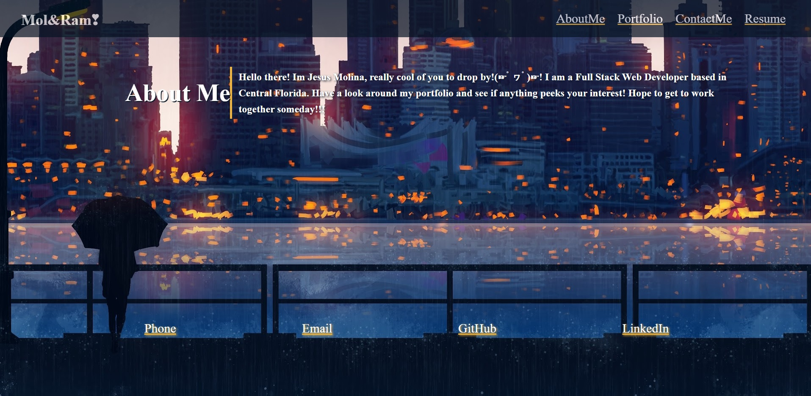

# React Portfolio

Using the power of React, I transformed my original CSS portfolio into a React Portfolio(While also adding some new things).

## **Table of Contents**
* [Deployed](#Deployed)
* [Screenshot](#Screenshot)
* [Credits](#Credits)

## Deployed
## Deployment
[Deployed application here](https://kos-mosv4.github.io/react-portfolio/)

## Screenshot

## Credits
Created by Jesus Molina

## Contact Me
Contact Me At:
Email: Jesusm1948@gmail.com
GitHub: https://github.com/Kos-MosV4
